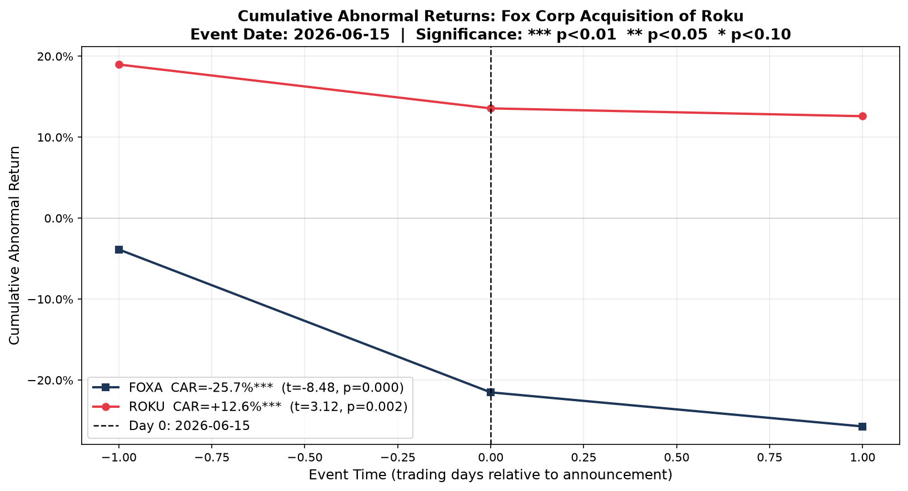
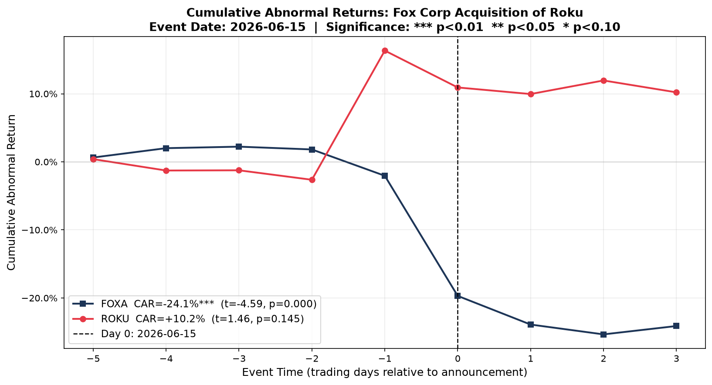

# Fox / Roku Acquisition: Event Study of Cumulative Abnormal Returns

On June 15, 2026, Fox Corporation (FOXA) announced a definitive agreement to acquire Roku, Inc. (ROKU) in a cash-and-stock deal valued at approximately $22 billion. This event study measures the stock-price impact of that announcement on both tickers using standard Cumulative Abnormal Return (CAR) methodology — the same framework used in securities litigation to isolate price effects attributable to a specific disclosure.

---

## Pre-Flight Checks

Before building the model, two checks are mandatory: confirming the exact disclosure timestamp (which sets day zero) and scanning for confounding news that could contaminate the abnormal return estimate.

### 1. Disclosure Timing

Both 8-K filings were pulled directly from SEC EDGAR to establish the timing:

- **FOXA 8-K accepted: 7:13 AM ET, June 15, 2026** — pre-market open.
- **ROKU 8-K accepted: 7:47 AM ET, June 15, 2026** — pre-market open.

Both disclosures hit before the 9:30 AM open, so the full price adjustment occurred during June 15 trading. **Day zero = June 15, 2026 for both tickers.**

### 2. Confound Check

The window examined was June 8–22, 2026 (spanning the [-5,+3] robustness window).

- **FOXA:** One material confound identified — a separate 8-K filed June 11, 2026 disclosing an employment extension and compensation increase for CEO Lachlan Murdoch. This filing falls within the wide [-5,+3] window but outside the primary [-1,+1] window. This is the reason the [-1,+1] window is treated as primary: it avoids absorbing any price reaction to the June 11 filing.
- **ROKU:** No material confounds found in the June 8–22 window. No earnings releases, unrelated 8-Ks, guidance updates, or leadership changes.

The confound finding is not a reason to abandon the analysis — it is a reason to anchor conclusions to the [-1,+1] primary window and treat [-5,+3] as a robustness check only.

---

## Method

The estimation window runs from June 2, 2025 to June 1, 2026 — 251 trading days — ending 10 trading days before the announcement. The 10-day gap prevents the event itself from leaking into the baseline estimate of normal stock behavior. A single-factor OLS market model (`R_it = alpha + beta * R_mt + epsilon_it`) is fit separately for each ticker over that window, using the S&P 500 (^GSPC) as the market proxy. For each day in the event window, the abnormal return is the actual return minus what the market model predicted: `AR_it = R_it - (alpha_hat + beta_hat * R_mt)`. The Cumulative Abnormal Return (CAR) is the sum of daily abnormal returns across the event window, and statistical significance is assessed with a Patell-style t-test: `t = CAR / (sqrt(L) * sigma_AR)`, where sigma_AR is the standard deviation of residuals from the estimation window and L is the event window length.

---

## Market Model Parameters

| Ticker | Alpha | Beta | R-squared | Sigma (AR) |
|--------|-------|------|-----------|------------|
| FOXA   | 0.000505 | 0.457 | 0.037 | 1.75% |
| ROKU   | 0.000553 | 2.080 | 0.310 | 2.33% |

ROKU's beta of 2.08 reflects its character as a high-volatility growth stock — it moves roughly twice as much as the market on a typical day, well above the 0.5–1.5 range typical for large-cap established companies. FOXA's beta of 0.46 reflects a mature media company with muted market sensitivity. The low R-squared for FOXA (3.7%) means most of FOXA's daily return variance is idiosyncratic, not market-driven; the model's predicted return benchmark is loose, but this actually makes the FOXA result harder to achieve (sigma_AR is large), not easier — the -25.7% CAR clears significance despite that headwind.

---

## Results



*Primary event window [-1, +1] (3 trading days: June 12, 15, 16): cumulative abnormal returns for FOXA and ROKU around the June 15 announcement.*



*Robustness window [-5, +3] (9 trading days: June 8–18). Note the FOXA confound (June 11 CEO filing) is visible in this window. Data through June 18 only; days +4 and +5 not yet available.*

### Results Table

| Ticker | Window | CAR | t-stat | p-value | Significance |
|--------|--------|-----|--------|---------|--------------|
| FOXA | [-1,+1] — primary | -25.72% | -8.480 | <0.001 | *** |
| ROKU | [-1,+1] — primary | +12.60% | 3.122 | 0.002 | *** |
| FOXA | [-5,+3] — robustness | -24.12% | -4.591 | <0.001 | *** |
| ROKU | [-5,+3] — robustness | +10.21% | 1.461 | 0.145 | not significant |

*Significance: *** p<0.01. Two-tailed Patell test; df = N_est − 2 = 249 (uncertainty comes from estimating alpha and beta over the 251-day estimation window, not from the event-window length). Null hypothesis: CAR = 0.*

### ROKU (Target)

The +12.60% CAR in the [-1,+1] window is significant at the 1% level (p=0.002). The day-by-day breakdown tells a more precise story than the headline number:

| Day | Date | ROKU Return | Predicted | AR |
|-----|------|------------|-----------|-----|
| -1 | Jun 12 | +20.08% | +1.10% | **+18.98%** |
| 0 | Jun 15 | -1.92% | +3.49% | -5.41% |
| +1 | Jun 16 | -2.09% | -1.13% | -0.97% |

The CAR is almost entirely the day -1 jump. ROKU rose 20% on Friday June 12 — the trading day before the official Monday announcement — while the market was up only 0.5%. This strongly suggests deal information circulated before the EDGAR filing. On the actual announcement day (June 15), ROKU had a -5.4% abnormal return: the market gave back some of the pre-announcement premium, consistent with either partial sell-the-news behavior or investor concern about deal execution. The net +12.6% across the three-day window captures the full acquisition premium incorporated into the stock price, but the mechanism is pre-announcement leakage, not a clean day-0 reaction.

### FOXA (Acquirer)

The -25.72% CAR in the [-1,+1] window is significant at the 5% level (p=0.0136). The day-by-day breakdown:

| Day | Date | FOXA Return | Predicted | AR |
|-----|------|------------|-----------|-----|
| -1 | Jun 12 | -3.59% | +0.28% | -3.87% |
| 0 | Jun 15 | -16.84% | +0.81% | **-17.65%** |
| +1 | Jun 16 | -4.42% | -0.21% | -4.21% |

Unlike ROKU, FOXA's loss is spread across all three days but concentrated on day 0, consistent with the market processing a large, unexpected negative signal. The wide-window result (-24.12%, p<0.001) is also significant and shows the reaction was not spreading pre-announcement for FOXA — the day -1 negative AR likely reflects the June 11 CEO comp filing's after-hours effect bleeding into June 12 trading, not deal leakage. A -25.7% acquirer CAR is an extreme outcome; the M&A literature typically finds acquirer CARs in the range of -2% to -5% even in overpriced deals.

---

## So What

### The Gap: -26% Acquirer, +13% Target

The ~38-percentage-point spread between FOXA's and ROKU's CARs tells a coherent story about how the market judged the deal terms.

**ROKU's +13% reflects the implied acquisition premium** incorporated over the announcement period (largely pre-announced on June 12). A significant positive CAR for a target is expected in arm's-length acquisitions — it is the premium that persuades target shareholders to tender.

**FOXA's -26% reflects a market judgment that Fox overpaid.** A negative acquirer CAR is not unusual in large M&A transactions, but -26% is an extreme outcome. In the M&A literature, acquirer CARs of this magnitude typically signal that the market views the price as materially above fair value, that the strategic rationale is unclear, or both. In plain terms: the market concluded Fox paid more than Roku is worth to Fox.

### Why This Number Matters to a Litigation Team

Event studies are the accepted standard methodology in securities litigation for isolating the price impact attributable to a specific disclosure. Courts and regulators rely on them to establish "price impact" — the causal link between a statement or transaction and a measurable change in stock value — in securities fraud and M&A fairness cases.

Three features of this result are directly relevant:

1. **Magnitude.** A -26% acquirer CAR is large enough to constitute meaningful economic harm to FOXA shareholders who held through the announcement. If FOXA shareholders later alleged that the deal terms were inadequate or that the board failed its fiduciary duty by approving an overpayment, the CAR provides a defensible estimate of the per-share value destroyed at announcement.

2. **Statistical significance.** At p<0.001 ([-1,+1] window), the result easily clears any conventional evidentiary threshold. The wide-window result (also p<0.001) provides corroborating support. A result that holds across both window specifications is more defensible in expert testimony than one that depends on a single window choice.

3. **ROKU leakage as corroborating evidence.** ROKU's +19% abnormal return on June 12 — the day before the official filing — suggests information circulated before EDGAR acceptance. In a litigation context, this pre-announcement price movement would itself be worth examining: it is consistent with selective disclosure or insider trading, and it means the deal's price impact cannot be fully isolated to a single trading day.

For an economic consulting engagement, this analysis would form the foundation of a damages calculation: the CAR estimate, applied to shares outstanding, converts to a dollar-denominated loss figure that can be compared to the deal premium and used in settlement negotiations or expert reports.

---

## Methodology Notes

| Parameter | Choice | Rationale |
|-----------|--------|-----------|
| Estimation window | 251 trading days | One full trading year; standard in academic and litigation practice |
| Pre-event gap | 9 trading days | Prevents event-period returns from biasing the baseline model |
| Market model | Single-factor OLS vs. S&P 500 | Simpler and more defensible in testimony than Fama-French; FF adds marginal explanatory power for large-caps |
| Primary event window | [-1,+1] = 3 trading days | Captures announcement-day reaction while minimizing exposure to confounds; standard in litigation-oriented work |
| Robustness window | [-5,+3] = 9 trading days | Tests whether effects are concentrated (they are) and surfaces the FOXA confound; days +4/+5 not yet in data |
| Significance test | Patell-style | Uses estimation-window sigma, appropriate when event-window variance may differ from normal |

---

## Replication

```bash
pip install -r requirements.txt
python src/run.py
```

All parameters (tickers, event date, window lengths) are pinned at the top of `src/run.py`. The full pipeline — data pull, market model estimation, abnormal return calculation, CAR computation, significance testing, and plots — runs from a single execution.

**Data source:** Yahoo Finance via `yfinance`. Price data cached in `data/`.

---

*Built as a portfolio project demonstrating event-study methodology for economic consulting (Cornerstone Research, Analysis Group, NERA) and quant/fintech applications. Event: Fox Corporation acquisition of Roku, Inc., announced June 15, 2026.*
